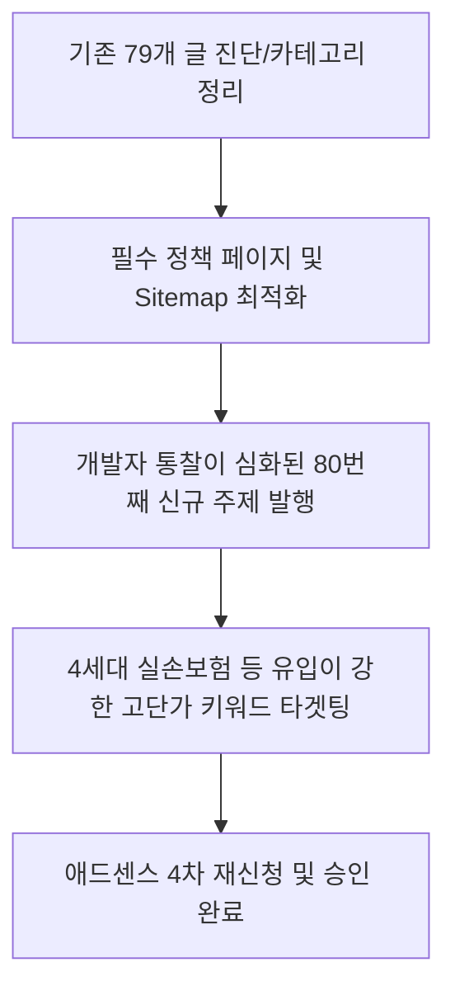

# 🔍 구글 애드센스 3회 거절 진단 및 채널 부활 전략 보고서

애드센스에 3번이나 연속 탈락한 후 재신청을 포기하신 상태는 블로그의 **'콘텐츠 구조'** 또는 **'웹사이트 기술적 세팅'**에 구글이 싫어하는 명확한 패턴이 반복되었기 때문입니다. 이를 해결하지 않고 글만 채우는 것은 밑 빠진 독에 물 붓기입니다. 

[전략기획부]의 관점에서 3회 탈락 원인을 정밀 분석하고, 채널을 완전히 부활시키기 위한 개선 방향을 제시합니다.

---

## 1. 3회 탈락 핵심 원인 분석 (가설 및 진단)

구글 애드센스 거절 사유의 90%는 **"가치 없는 콘텐츠(Low Value Content)"** 또는 **"사이트 탐색(Site Navigation)"** 문제에 해당합니다. 

### ① AI 패턴 반복으로 인한 유사도 필터링 (가장 높은 확률)
* **문제점**: 79개의 글 중 다수가 챗GPT 기본 템플릿을 사용하여 작성되었다면, 문장의 서두, 어조(예: "~에 대해 알아보겠습니다", "첫째, 둘째"), 구성 방식이 고도로 유사해집니다. 구글 검색 엔진은 독창적인 정보가 없거나, 다른 글들과 패턴이 너무 유사한 사이트를 "스팸성/유사 콘텐츠"로 분류하여 승인을 거절합니다.
* **보완**: 기존에 제공되던 규칙인 **"개발자적 통찰(시스템 분석적 시각, 에러 처리, API 등의 비유)"**을 가볍게 1~2줄 넣는 수준을 넘어, **글의 아키텍처 자체를 개발자 블로그나 테크 리포트 수준으로 엄격하고 상세하게 빌드**해야 합니다.

### ② 사용자 경험(UX) 및 탐색(Navigation) 부실
* **문제점**: 블로그의 카테고리는 6개로 쪼개져 있는데 카테고리당 글 개수가 너무 적거나, 빈 카테고리가 존재하여 검색 봇이 "미완성 사이트"로 판단했을 수 있습니다.
* **보완**: 6개 카테고리에 글이 골고루 분배되도록 하고, 승인 전까지는 빈 카테고리나 글이 3개 미만인 카테고리는 과감히 메뉴에서 숨겨야 합니다.

### ③ 필수 정책 페이지 부재
* **문제점**: 구글 애드센스는 개인정보처리방침(Privacy Policy), 서비스 이용약관, 문의하기(Contact) 페이지가 메뉴에 명시되어 있지 않은 블로그를 신뢰하지 않습니다.
* **보완**: 블로그 하단이나 메뉴에 해당 필수 페이지들을 즉시 생성해야 합니다.

---

## 2. (주)인슈어테크 랩스의 부활 전략 및 마일스톤

우리는 단순 "승인용" 글쓰기에서 벗어나, **"실제 사용자가 문제를 해결하기 위해 찾을 수밖에 없는 테크 가이드"**로 블로그를 리브랜딩합니다.

### 단계별 액션 플랜

| 단계 | 부서 | 작업 내용 | 목표 결과물 |
| :--- | :--- | :--- | :--- |
| **Step 1** | **전략기획부** | 카테고리 재조정 & 필수 페이지 확인 | 빈 카테고리 숨김, 개인정보 처리방침 페이지 생성 |
| **Step 2** | **콘텐츠부** | 개발자 시각이 고도로 반영된 전문 글 작성 | 기계적 AI 문체 완전 제거, 본문 2,500자 이상 확보 |
| **Step 3** | **디자인부** | 템플릿화된 저품질 그래픽 배제 | 신뢰감을 주는 모던 테크 썸네일 & 카드뉴스 생성 |
| **Step 4** | **운영부** | Search Console 등록 및 색인 모니터링 | 발행 즉시 구글 봇이 크롤링하도록 강제 색인 요청 |

---

## 3. 결론 및 다음 단계 제안

우리의 다음 행동은 **`d:\antigravity\InsureTech_Labs\strategy_planning/adsense_audit_report.md`**에 애드센스 승인을 통과하기 위한 체크리스트를 만들고, 

**지침서의 누적 수치와 규칙을 그대로 승계하여 `d:\antigravity\InsureTech_Labs/control_tower_manual.md` 마스터 지침서를 생성하는 것입니다.**

위 진단과 방향성에 대해 어떻게 생각하시는지 의견을 말씀해주시면 바로 마스터 파일 세팅과 신규 글 기획을 시작하겠습니다!
